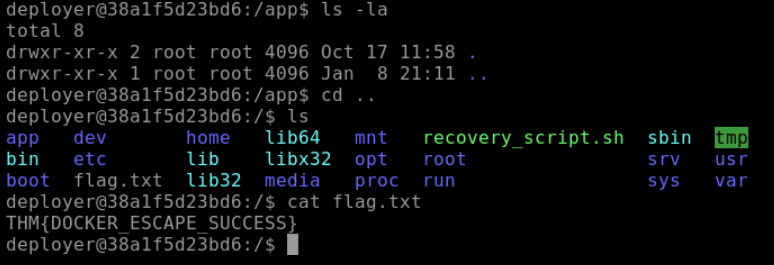

# 🐳 Docker Security Analysis: Container Escape & Privilege Escalation

## 🛡️ Project Overview
This project involves a security audit and remediation of a compromised microservices architecture ("DoorDasher"). The objective was to investigate a defaced web application, identify container misconfigurations, and perform a **Docker Container Escape** to regain administrative control and restore system integrity.

The simulation demonstrates critical risks in container orchestration, specifically focusing on the dangers of exposing Unix sockets (`/var/run/docker.sock`) to unprivileged containers and sensitive information disclosure within internal services.

## 🛠️ Technical Stack
* **Environment:** Ubuntu Linux 22.04 LTS
* **Container Runtime:** Docker Engine
* **Architecture:** Microservices (Web App, Monitoring, Deployment, Database)
* **Vulnerability:** Insecure Docker Socket Mount & Privilege Escalation
* **Tools Used:** Docker CLI, Bash, Linux System Administration

## 🔍 Vulnerability Assessment

### 1. Service Enumeration
The initial audit began by identifying active services on the host system. Using the Docker CLI, I enumerated the running containers to understand the architecture.

*Figure 1: Identifying the four active microservices: `deployer`, `dasherapp`, `wareville-times`, and `uptime-checker`.*

### 2. Misconfiguration Discovery
A deep dive into the `uptime-checker` container revealed a critical security flaw. The host's Docker socket was mounted inside this container.
* **The Risk:** The Docker socket (`/var/run/docker.sock`) is the primary communication channel for the Docker API. Mounting this into a container grants that container full control over the Docker daemon on the host system, effectively bypassing isolation.

*Figure 2: Verifying the presence of the mounted Docker socket inside the `uptime-checker` container.*

### 3. Credential Harvesting (Bonus)
During the reconnaissance phase, I analyzed the internal news service (`wareville-times`) running on port 5002. By carefully inspecting the content of the "breaking news" articles, I discovered sensitive credentials hidden within the text.

*Figure 3: Recovering the `deployer` user password (`DeployMaster2025!`) via pattern analysis of internal communications.*

## ⚡ Exploitation Path (The "Escape")

### Step 1: Container Breakout
By leveraging the exposed socket, I was able to execute Docker commands *from within* the compromised container. This allowed me to view and control peer containers, a technique known as a **Container Escape**.

*Figure 4: Successfully executing `docker ps` from inside the restricted container, proving control over the host daemon.*

### Step 2: Lateral Movement
With control over the Docker daemon, I pivoted to the `deployer` container. This container was identified as a privileged administrative unit capable of system restoration.

### Step 3: Service Restoration
Once access to the `deployer` container was established (via `docker exec`), I located and executed the disaster recovery scripts. This process reverted the malicious changes made to the "DoorDasher" application.

*Figure 5: Running the `recovery_script.sh` to restore the application to its original state.*

### Step 4: Verification
The successful execution of the recovery plan was confirmed by retrieving the system flag, signifying complete restoration of the service.

*Figure 6: Proof of root access and successful system recovery (`THM{DOCKER_ESCAPE_SUCCESS}`).*

## 🔐 Remediation & Best Practices
To prevent this vulnerability in production environments, the following hardening steps are recommended:

1.  **Restrict Socket Access:** Never mount `/var/run/docker.sock` inside a container unless absolutely necessary for the application's function.
2.  **Use Specialized Proxies:** If a container requires access to the Docker API (e.g., for monitoring), use a proxy like `docker-socket-proxy` that filters requests and allows only read-only access to specific endpoints.
3.  **Secrets Management:** Never hardcode credentials in application content or source code. Use a secrets manager (like Docker Secrets or HashiCorp Vault).
4.  **Rootless Docker:** Run the Docker daemon as a non-root user. This limits the potential damage if an attacker successfully escapes a container.

## 🎓 Key Takeaways
* **Isolation is not absolute:** Misconfigurations can easily break the security boundary between a container and the host.
* **Information Leakage:** Security is not just technical; it's also about policy. Sensitive data should never be embedded in user-facing content.
* **Lateral Movement:** One compromised low-value container (like an uptime checker) can lead to a full system compromise if privileges are not scoped correctly.
